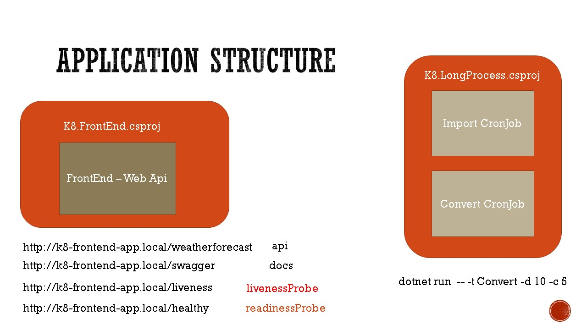
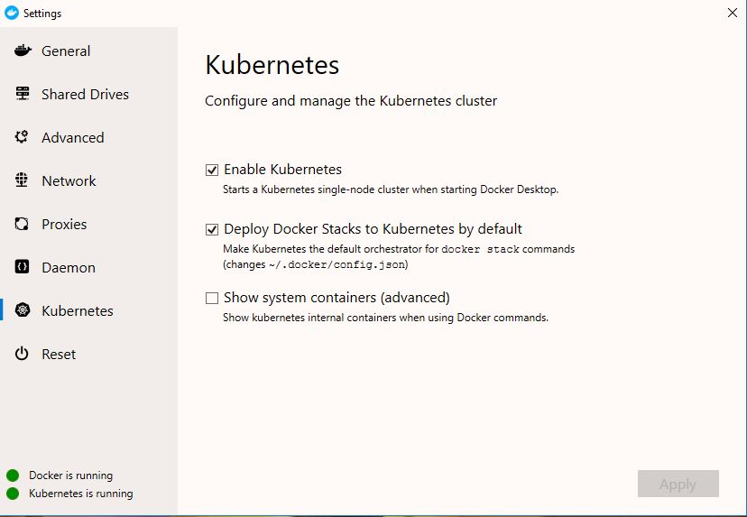
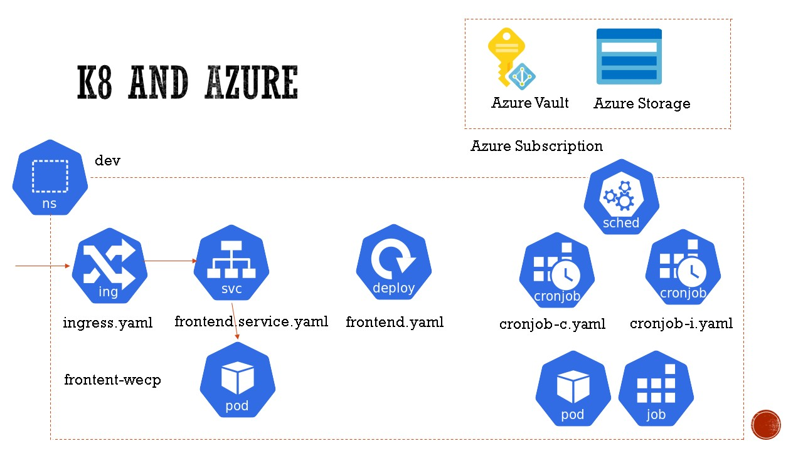

# Kubernetes DotNetCore Workshop

This workshop will provide with ability to learn the basics of the Kubernetes development from DotNetCore developer perspective.

The solution includes the following projects:


- `K8.AspNetCore.HealthChecks.csproj` - a simple project that demonstrates how to add custom HealthChecks.
- `K8.Extensions.Configuration.csproj` - a project that creates a custom Azure Key Vault Secrets retrieval.
- `K8.Extensions.Hosting.csproj` - a project that demonstrates how to extend hosting creation for the common K8s projects.
- `K8.FrontEnd.csproj` - the `AspNetCore` Web Api project that demonstrates usage of health and liveliness checks.
- `K8.LongProcess.csproj` - the DotNetCore 3.0 Worker Hosted Console App that runs custom K8s CronJobs.

## Technologies

- Docker Containers
- Kubernetes Cluster
- Helm deployment
- Microsoft Azure Managed Identity (MSI)

## Pre-requisites

1. Install Docker and Local Kubernetes Cluster on Windows 10

- [Install Hyper-V on Windows 10](https://docs.microsoft.com/en-us/virtualization/hyper-v-on-windows/quick-start/enable-hyper-v)

- [Install Docker Desktop on Windows](https://docs.docker.com/docker-for-windows/install/)

- Enable Local Kubernetes Cluster: Docker --> Settings --> Kubernetes


- [Install alternative K8 dashboard](https://github.com/kubernetes/dashboard/releases/tag/v1.10.1)

This dashboard doesn't require token authentication, since the cluster is running on the local machine.

```bash
    # install
    kubectl apply -f https://raw.githubusercontent.com/kubernetes/dashboard/v1.10.1/src/deploy/alternative/kubernetes-dashboard.yaml

    # launch the dashboard
    kubectl proxy

    # dashboard url 'http://localhost:8001/api/v1/namespaces/kube-system/services/http:kubernetes-dashboard:/proxy/#!/overview?namespace=default'
```

The UI dashboard is useful for learning and management purposes.

[Open Local Kuberbetes Cluster Dashboard](http://localhost:8001/api/v1/namespaces/kube-system/services/http:kubernetes-dashboard:/proxy/#!/overview?namespace=default)

- [Install `Ngnix` Ingress Controller inside Local Kubernetes Cluster](https://kubernetes.github.io/ingress-nginx/deploy/#docker-for-mac)

This component is required for the labs.

```bash
    # installation
    kubectl apply -f https://raw.githubusercontent.com/kubernetes/ingress-nginx/master/deploy/static/mandatory.yaml
    kubectl apply -f https://raw.githubusercontent.com/kubernetes/ingress-nginx/master/deploy/static/provider/cloud-generic.yaml

    # validate installation
    kubectl get pods --all-namespaces -l app.kubernetes.io/name=ingress-nginx --watch
```

2. [Install the Azure CLI](https://docs.microsoft.com/en-us/cli/azure/install-azure-cli?view=azure-cli-latest)

3. [Install Visual Studio Code](https://code.visualstudio.com/insiders/)

4. Update Windows 10 Hosts file update to include `C:\Windows\System32\drivers\etc\hosts`

```txt
    127.0.0.1 kubernetes.docker.internal k8-frontend-app.local
```

This `hosts` entry provides with the following local development Url for the application

[https://k8-frontend-app.local/weatherforecast](https://k8-frontend-app.local/weatherforecast)

5. [Install `Local Managed Service Identity (MSI) Azure Local Authenticator`](./docs/azure-vault.md)

6. [Create Azure Key Vault](https://docs.microsoft.com/en-us/cli/azure/keyvault?view=azure-cli-latest#az-keyvault-create)

7. [Create Azure Storage Account](./docs/azure-storage.md)


## Labs


1. [Lab: Build Docker Images](./docs/docker.md)
2. [Lab: `Kubectl` commands](./docs/kubectl.md)
3. [Lab:  Helm simple release](./docs/helm-simple.md)
4. [Lab:  Helm templated release](./docs/helm-templated.md)

## References

- [LIVENESS PROBES ARE DANGEROUS](https://srcco.de/posts/kubernetes-liveness-probes-are-dangerous.html)

- [Getting external traffic into Kubernetes – ClusterIp, NodePort, LoadBalancer, and Ingress](https://www.ovh.com/blog/getting-external-traffic-into-kubernetes-clusterip-nodeport-loadbalancer-and-ingress/)

- [Kubernetes Ingress scenario](https://codeburst.io/replicate-kubernetes-ingress-locally-with-docker-compose-2872e650af6b)

- [Deploying a Stateful Application on Azure Kubernetes Service (AKS)](https://blog.risingstack.com/deploying-a-stateful-application-on-azure-kubernetes-service-aks/)

- [Use Azure managed identities with Azure Kubernetes Services (AKS)](https://blog.jcorioland.io/archives/2018/09/05/azure-aks-active-directory-managed-identities.html)

- [Azure/aad-pod-identity](https://github.com/Azure/aad-pod-identity)

- [Control access to cluster resources using role-based access control and Azure Active Directory identities in Azure Kubernetes Service](https://docs.microsoft.com/en-us/azure/aks/azure-ad-rbac)

- [Create an ingress controller with a static public IP address in Azure Kubernetes Service (AKS)](https://docs.microsoft.com/en-us/azure/aks/ingress-static-ip)

- [https://dev.to/ianknighton/deploying-a-microservice-on-azure-kubernetes-with-lets-encrypt-4eon](https://dev.to/ianknighton/deploying-a-microservice-on-azure-kubernetes-with-lets-encrypt-4eon)

- [Service principals with Azure Kubernetes Service (AKS)- Manually create a service principal](https://docs.microsoft.com/en-us/azure/aks/kubernetes-service-principal#manually-create-a-service-principal)

- [fbeltrao/aks-letsencrypt](https://github.com/fbeltrao/aks-letsencrypt/blob/master/install-nginx-ingress.md)